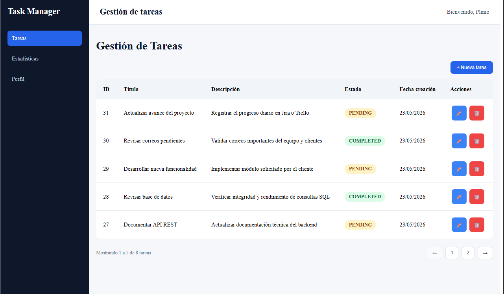
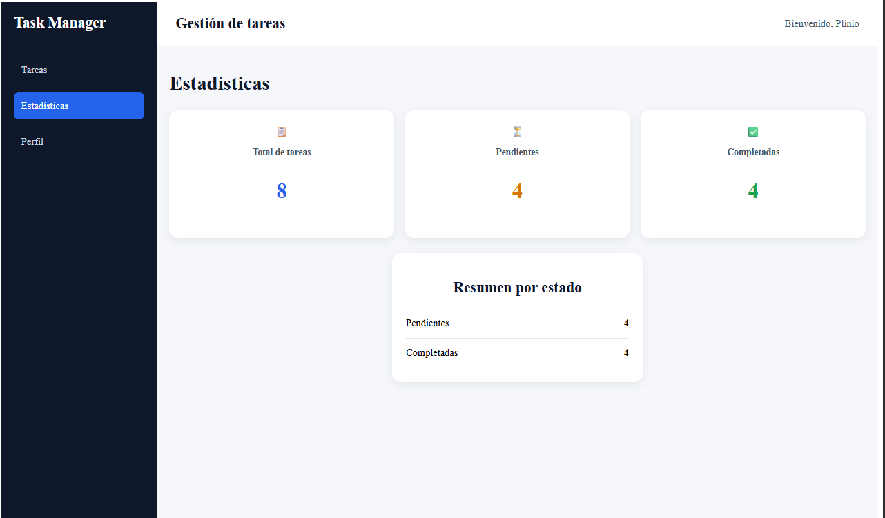

# Task Management System

Aplicación Full Stack para gestión de tareas desarrollada como prueba técnica utilizando Java Spring Boot y Angular.

---

## Tecnologías utilizadas

### Backend
- Java 21
- Spring Boot
- PostgreSQL
- Maven
- Arquitectura MVC
- Repository Pattern

### Frontend
- Angular
- TypeScript
- HTML5
- CSS3

---

## Funcionalidades

- Crear tareas
- Editar tareas
- Eliminar tareas
- Listar tareas
- Validaciones de formularios
- Estadísticas básicas
- Paginación
- Diseño responsive
- Mensajes dinámicos (toast notifications)

---

## Vistas del sistema

### Gestión de tareas

### Estadísticas

---
## Configuración Backend

Crear previamente la base de datos PostgreSQL:

CREATE DATABASE task_manager_db;

### Configurar las siguientes variables de entorno:

- DB_URL=jdbc:postgresql://localhost:5432/task_manager_db
- DB_USERNAME=postgres
- DB_PASSWORD=your_password

### Ejecutar Backend
cd taskmanager
mvn spring-boot:run

### Backend disponible en:

http://localhost:8081

Swagger:

http://localhost:8081/swagger-ui/index.html

